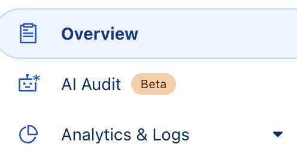

# Easy DDNS for Cloudflare

Actualiza automáticamente registros DNS tipo A en Cloudflare con tu IP pública actual, ideal para conexiones con IP dinámica. El proyecto se ejecuta en un contenedor Docker Alpine con `cron` para actualizaciones periódicas.

# ¿Qué necesitas?

Solo necesitas tener instalado:
- Docker
- Docker Compose

# Crea un archivo `.env` con el siguiente contenido:

```env
ZONE_ID=tu_zone_id
API_TOKEN=tu_token_de_cloudflare
DNS_NAMES=sub1.tudominio.com,sub2.tudominio.com,sub3.tudominio.com
```

## ¿Dónde buscar las variables para .env?

Ve a tu dominio y en la sidebar busca la opción que dice '*overview*' y la seleccionas.


Baja en hasta encontrar la seccion '*API*'.


Una vez en la seccion API, puedes copiar tu '**ZONE_ID**', también aquí encontrarás el boton para obtener tu '**API_TOKEN**", para ello debes seleccionar el boton que dice '*Get your API token*'.


Creas tu token.


Seleccionas '*Edit Zone DNS*'.


Configuras tu token, en permisos debes seleccionar los valores que tiene en la imagen.
Una vez lista la configuracion puedes guardarla.

(Nota: Aparecerá una sección intermedia llamada summary, en la cual podrás ver un resumen de la configuración del token, puedes saltarla para ir directamente al paso siguiente)


Y finalmente copias tu '**API_TOKEN**'